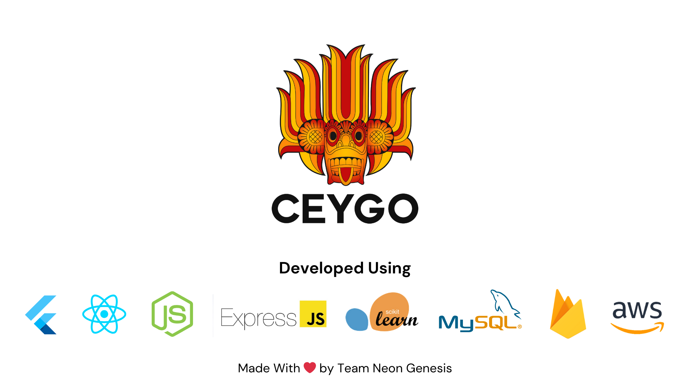
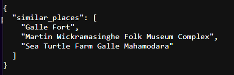

# Team Neon Genesis - CeyGo



`CeyGo` is a travel guide app designed to attract tourists to our tropical paradise, Sri Lanka.


## Prerequisites

- `Flutter` 3.24.1
- `Dart` 3.5.1
- `React` 18.3.1
- `Node` 20.17.0
- `Scikit-learn` 1.5.1
- `MySQL` 8.0.39

# Setup

### Flutter App - Client Side
```bash
my_flutter_app/
│
├── android/               # Android native code for Android platform
│   ├── app/               # Contains Android-specific application logic
│   ├── gradle/            # Gradle build configuration files
│   └── src/               # Android Java/Kotlin source files
│
├── ios/                   # iOS native code for iOS platform
│   ├── Runner/            # Contains iOS app-specific logic
│   ├── Flutter/           # Flutter build files for iOS
│   └── Podfile            # CocoaPods dependencies for iOS
│
├── lib/                   # Main Flutter application code
│   ├── controller/        # Controllers managing app business logic (state, navigation)
│   ├── model/             # Data models used across the app
│   │   ├── custom_icons.dart  # Custom icons for the UI
│   │   ├── place.dart         # Data model for places (tourist destinations)
│   │   └── user.dart          # Data model for user information
│   ├── service/           # Services for API calls, authentication, etc.
│   │   ├── auth_helper.dart       # Helper functions for authentication
│   │   ├── auth_service.dart      # Authentication service (login, signup)
│   │   ├── favourite_service.dart # Manage favorite places
│   │   ├── place_service.dart     # Service to handle place data and recommendations
│   │   ├── previous_search_service.dart  # Service to manage previous searches
│   │   └── visa_service.dart      # Service to handle visa processing workflow
│   ├── screens/           # App screens (UI layout and widgets)
│   ├── widgets/           # Reusable UI components (buttons, forms, etc.)
│   ├── main.dart          # Main entry point of the app (initialization)
│
├── ui/                    # UI components and screens
│   ├── Home Screen/             # Home screen UI
│   ├── Login Screen/            # Login screen UI
│   ├── Navigation Bar/          # Custom navigation bar for the app
│   ├── New Password Screen/     # UI for password reset process
│   ├── Profile Screen/          # User profile screen
│   ├── Profile Settings Screen/ # Profile settings screen
│   ├── Routes Screen/           # UI for routes and navigation
│   ├── Search Screen/           # Search feature UI
│   │   └── search_screen.dart   # Dart file for search screen functionality
│   ├── Sign Up Details/         # UI for additional sign-up details
│   ├── SignUp Screen/           # Sign-up screen for new users
│   ├── Slide Screen/            # Slide UI for onboarding or tutorials
│   ├── Splash Screen/           # Initial splash screen
│   ├── Srearch Place Screen/    # UI for place search functionality
│   │   └── search_place_screen.dart  # Dart file for searching places
│   ├── Visa Process Screen/     # UI for visa application process
│   ├── Visa Status Screens/     # UI for checking visa status
│   ├── Welcome Screen/          # Welcome screen after user logs in
│   └── firebase_options.dart    # Firebase configuration options for app
│
├── test/                  # Unit and widget tests for the app
│
├── build/                 # Generated build files (compiled code)
│
├── pubspec.yaml           # Project configuration and third-party dependencies
│
├── pubspec.lock           # Version-locked dependencies to maintain consistency
│
├── README.md              # Project documentation (overview, setup, etc.)
│
└── .gitignore             # Files and directories to ignore in git version control
```
- Clone the repository to your device

```
git clone https://github.com/DulaknaRandil/Neon-Genesis_CeyGO_Mobile-Application.git
```

- Open the project & Install the dependencies by

```dart
flutter pub get
```

- Load the secrets to the `.env` file (Secret keys are located in a separate document).
- Run the Flutter app by

```dart
flutter run
```
<hr>

### React - Admin Dashboard

```bash
my-react-app/
│
├── public/                # Static files, such as index.html
│   ├── favicon.ico        # App favicon
│   ├── index.html         # Main HTML file
│   └── manifest.json      # Web app manifest
│
├── src/                   # Main application code
│   ├── assets/            # Images, fonts, etc. 
│   ├── components/        # Reusable components
│   │   ├── Button.js      # Example reusable button component
│   │   ├── BarChart.jsx        # Bar chart visualization component
│   │   ├── Geography.jsx       # Component for geography-based data display
│   │   ├── Header.jsx          # Header component for the app
│   │   ├── LineChart.jsx       # Line chart visualization component
│   │   ├── PieChart.jsx        # Pie chart visualization component
│   │   ├── ProgressCircle.jsx  # Circular progress indicator component
│   │   └── StatBox.jsx         # Statistics box component for displaying data
│   ├── pages/             # Pages of the application 
│   │   ├── Home.js        # Example home page component
│   │   ├── Bar.jsx             # Bar chart data page
│   │   ├── Geo.jsx             # Geographical data page
│   │   ├── Interpol.jsx        # Interpol API verification page
│   │   ├── Line.jsx            # Line chart data page
│   │   ├── Pie.jsx             # Pie chart data page
│   │   ├── VisaApplication.jsx # Page for visa application submission
│   │   └── VisaPayments.jsx    # Page for managing visa payments
│   ├── screens/           # Screens within the application 
│   │   ├── dashboard/
│   │   │   ├── Dashboard.jsx    # Main dashboard screen
│   │   └── Login.jsx           # Login screen
│   ├── global/            # Global components (e.g., navigation, layout)
│   │   ├── SideBar.jsx         # Sidebar navigation component
│   │   └── TopBar.jsx          # Top bar navigation component
│   ├── services/          # API calls or business logic 
│   ├── hooks/             # Custom React hooks 
│   ├── context/           # Context API for state management 
│   ├── data/              # Static or fetched data 
│   ├── App.js             # Main app component
│   ├── firebase.js        # Firebase configuration
│   ├── index.js           # Entry point of the app
│   ├── index.css          # Global styles
│   └── theme.js           # Theme customization for the app
│
├── node_modules/          # Installed dependencies 
│
├── package.json           # Project configuration and dependencies
│
├── package-lock.json      # Version-locked dependencies 
│
├── .gitignore             # Files and directories to ignore in git
│
├── README.md              # Project documentation
```

- Clone the repository to your device

```
https://github.com/AnuradhaDilshan/Neon-Genesis_CeyGO_Admin-Dashboard.git
```

- Open the project & Install the dependencies by

```jsx
npm i
```

- Run the app by

```jsx
npm start
```
<hr>

### Recommondation Engine API

Using the following API link, you can view the recommonded places for your selected destination in JSON format (Hosted on a EC2 instance).

```
http://43.203.243.209/handle_get?name=galle
```



<hr>